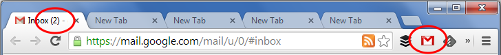

Gmail Button Experiments
========================

This is a derivative work of the [Google Mail Checker][] with the following modifications:

- The unread count is **hidden from you** during the core hours of the workday
- The count is shown again between **12p-1p** and **6p-8p**

Motivation
----------

This is an experimental project to help me be more productive in my day-to-day.
Inspiration comes from [Scott Hanselman][] and the observation that I
habitually click the mail button every time I notice I have mail.

This goes one step beyond turning off mail notifications.

Installation
------------

Simply drag-and-drop `gmail-button-experiments.crx` from the build directory into Chrome.

Contributing
------------

This is a project to help me with my own productivity, but if you've experimented
with this yourself, feel free to open a pull request.

If this ends up saving you time too, please consider supporting me on

[Google Mail Checker]: https://developer.chrome.com/extensions/samples#search:gmail
[Scott Hanselman]: https://vimeo.com/39020426
